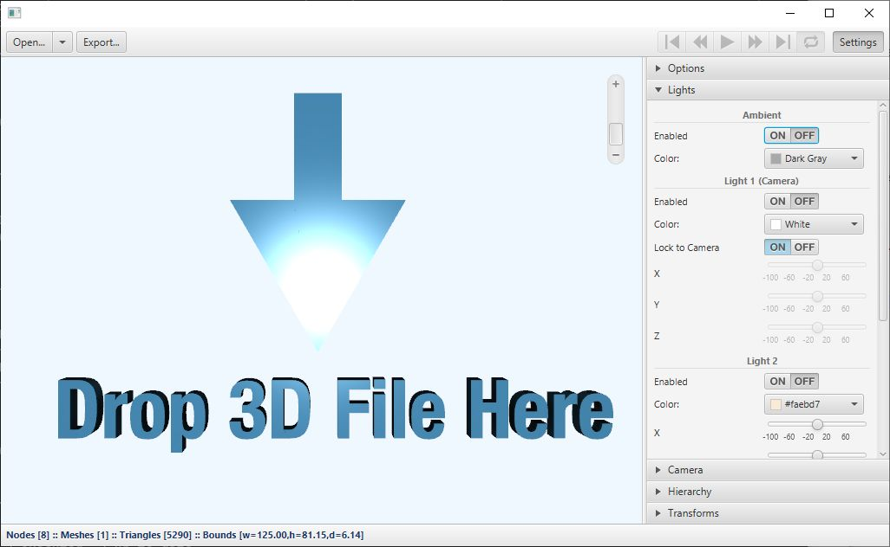

# 3D Model Viewer

This 3DViewer project is a sample JavaFX application extracted from
[openjdk/jfx/apps/samples/3DViewer](https://github.com/openjdk/jfx/tree/master/apps/samples/3DViewer).

Description for 3DViewer as excerpted from
[openjdk/jfx/apps/samples/samples_readme.txt](https://github.com/openjdk/jfx/blob/master/apps/samples/samples_readme.txt):

<pre>
	3DViewer is a sample application that allows the user to navigate and examine a 
	3D scene with a mouse or a trackpad. 3DViewer has importers for a subset of the 
	features in OBJ and Maya files. The ability to import animation is also 
	provided for Maya files. (Note that in the case of Maya files, construction 
	history should be deleted on all the objects when saving as a Maya file.) 
	3DViewer also has the ability to export the contents of the scene as Java or 
	FXML files.
</pre>

Screenshot of the 3DViewer application:

An excellent overview of this 3DViewer application is described in
[3DViewer: Better 3D for JavaFX](https://news.kynosarges.org/2018/04/08/3dviewer-better-3d-for-javafx/)
by Christoph Nahr.

The 3D model code in this application is used as a library dependency to the beautiful
[RubikFX](https://github.com/jperedadnr/RubikFX), a Rubik's Cube 3D simulator by José Pereda.

---

In this fork, the original Gradle build
[script](https://github.com/openjdk/jfx/blob/master/apps/samples/3DViewer/build.gradle)
is updated to build a stand-alone `Viewer3D` application and/or library, for Java/JavaFX 11+.
The name is changed from the default `3DViewer` to `Viewer3D`, to avoid the following error
at runtime when the jar file happens to be on the module path:

	Error occurred during initialization of boot layer
	java.lang.module.FindException: Unable to derive module descriptor for lib/3DViewer.jar
	Caused by: java.lang.IllegalArgumentException: 3DViewer: Invalid module name: '3DViewer' is not a Java identifier

A Maven build script is also added to this fork.

## Gradle build tasks

To build and run the application, execute the Gradle `run` task:

	gradlew run

By default JavaFX 3D will use GPU hardware acceleration for rendering. If hardware acceleration
is not available, i.e. the `Viewer3D` application shows an empty window, the software acceleration
feature can be used instead (but slow!) by setting the `prism.forceGPU` system property to `true`:

	gradlew run -Dprism.forceGPU=true

To create an executable uber jar which includes all dependencies for current OS platform:

	gradlew uberJar

and the resulting *platform-specific* `Viewer3D-1.0.0-SNAPSHOT-no-deps-<platform>.jar` file
should be created in `build/libs`, and can be executed directly with the `java` command
(e.g. in Linux):

	java -jar build/libs/Viewer3D-1.0.0-SNAPSHOT-no-deps-linux.jar

(or if building on a Windows machine:

	java -jar build\libs\Viewer3D-1.0.0-SNAPSHOT-no-deps-win.jar

)

To produce a [jlink image](https://dzone.com/articles/jlink-in-java-9)
of the `Viewer3D` application for the current platform, execute the `jlink` task:

	gradlew jlink

The resulting jlink image is in the folder:

	build/image

which can then be executed directly, for example in Linux:

	./build/image/bin/Viewer3D

(or if building on a Windows machine:

	build\image\bin\Viewer3D.bat

)

## Maven build tasks

To build and run the application, execute the Maven `javafx:run` command:

	mvnw javafx:run

By default JavaFX 3D will use GPU hardware acceleration for rendering. If hardware acceleration
is not available, i.e. the `Viewer3D` application shows an empty window, the software acceleration
feature can be used instead (but slow!) by setting the `prism.forceGPU` system property to `true`:

	mvnw javafx:run -Dprism.forceGPU=true

To create an executable uber jar which includes all dependencies for current OS platform:

	mvnw package

and the resulting *platform-specific* `Viewer3D-1.0.0-SNAPSHOT-no-deps-<platform>.jar` file
should be created in `target` folder, and can be executed directly with the `java` command
(e.g. in Linux):

	java -jar target/Viewer3D-1.0.0-SNAPSHOT-no-deps-linux.jar

(or if building on a Windows machine:

	java -jar target\Viewer3D-1.0.0-SNAPSHOT-no-deps-win.jar

)

To produce a [jlink image](https://dzone.com/articles/jlink-in-java-9)
of the `Viewer3D` application for the current platform, execute the Maven `javafx:jlink` command:

	mvnw javafx:jlink

The resulting jlink image is in the folder:

	target/image

which can then be executed directly, for example in Linux:

	./target/image/bin/Viewer3D

(or if building on a Windows machine:

	target\image\bin\Viewer3D.bat

)

## IDE support

The project can be imported as-is to any IDE such as Eclipse, IntelliJ IDEA, etc.,
which understands a Gradle/Maven project structure.

